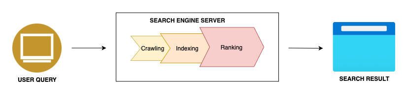

# How the web works and web protocols, and how popular services are implemented on the web.

The World Wide Web or popularly known as the web has revolutionized the way we communicate, learn and interact with the world. But have you ever wondered how it all works? In this article, I will be breaking down the basic principles behind the web, the protocols that make it function and how popular services like streaming platforms, e-commerce sites and social media are implemented.

## The Basics of the Web

The web is a service built on the internet that enables access to interlinked documents and resources that are accessed over the browsers. The internet serves as the infrastructure, a global network of computers, while the web provides a way to share and access information on this network.

### Here's a simplified view of how the web works:

**User Interaction:** The process begins with the user interacting with a web browser by entering a URL (e.g., www.example.com). When you type a URL (e.g., www.example.com) into your browser, the browser perform these key action.

1. **DNS Query:** The browser sends a request to a DNS (Domain Name System) server to resolve the domain name into its corresponding IP address.


- www.example.com might resolve to an IP like 192.168.1.1.

2. **Request and Response Cycle:** After resolving the IP address, the browser sends an HTTP or HTTPS request to the server. This process involves:
- **Request Sent:** The browser requests specific resources (e.g., HTML, CSS, JavaScript) needed to display the web page.
- **Server Processing:** The server processes the request and sends back an HTTP response, typically containing an HTML document. For static websites, the server retrieves the HTML file from storage. For dynamic websites, the server might generate content using backend scripts or databases.
- **Response Sent:** The browser renders the HTML documents into a visually interactive web page using CSS and JavaScript.


### Key Steps in the Web Workflow
1. The user sends a request.
2. The server processes the request and sends back a response.
3. The browser renders the response (e.g., a web page).

## Web Protocols
Web protocols are standardized rules and conventions that govern how data is transmitted over the Internet. These protocols ensure reliable communication between clients and servers.

### Key protocols that power the web:

1. **DNS (Domain Name System):** 
DNS is a special type of server out there in the internet and the job of these DNS servers is to translate  domain names (e.g example.com) to IP addresses (e.g., 142.250.64.78). You can think of DNS as a phonebook for the web.

### Example: Performing a DNS Lookup in Python

Here's how you can perform a DNS lookup to find the IP address associated with a domain name:

```javascript
// Importing the 'dns' module for DNS lookups
const dns = require('node:dns');

// Performing a DNS lookup for the domain 'example.org'
dns.lookup('example.org', (err, address, family) => {
  if (err) throw err;
  // Logging the IP address and the IP family (IPv4 or IPv6) to the console
  console.log('address: %j family: IPv%s', address, family);
});
// Example output: address: "2606:2800:21f:cb07:6820:80da:af6b:8b2c" family: IPv6

2. **HTTP/HTTPS (Hypertext Transfer Protocol / Secure):** 
- **HTTP:** The primary protocol for transferring web pages and other resources between a client and a server.
- **HTTPS:** Adds an encryption layer using TLS (Transport Layer Security), ensuring secure communication and protecting sensitive information like passwords and credit card details.

3. **SMTP/IMAP/POP3 (Email Protocols):**
- **SMTP** (Simple Mail Transfer Protocol): Used to send emails.
- **IMAP** (Internet Message Access Protocol) and **POP3** (Post Office Protocol) are used to retrieve emails from servers.

4. **TCP/IP (Transmission Control Protocol/Internet Protocol):**
- **TCP:** Ensures reliable delivery of data packets by breaking them into smaller packets and reassembling them at the destination.
- **IP:** handles addressing and routing these packets across networks.

5. **HTML (Hypertext Markup Language):**
- Web pages are primarily structured using Hypertext Markup Language (HTML). HTML provides the framework for web content allowing browsers to render text, images, and other media.

### Example: HTML Code

Below is an example of a simple HTML document:

```html
<!DOCTYPE html>
<html lang="en">
<head>
    <meta charset="UTF-8">
    <meta name="viewport" content="width=device-width, initial-scale=1.0">
    <title>My Web Page</title>
</head>
<body>
    <h1>Welcome to My Web Page</h1>
    <p>This is an example of a basic web page.</p>
</body>
</html>
```

6. **FTP (File Transfer Protocol):**
- Used for transferring files between computers.

### FTP EXAMPLE

```javascript
// Import the 'ftp' module
const Client = require('ftp');

// Create a new instance of the FTP client
const c = new Client();

// Event listener for when the client is ready
c.on('ready', function() {
    // List the contents of the current directory on the FTP server
    c.list(function(err, list) {
        // If an error occurs, throw it
        if (err) throw err;
        
        // Log the list of directory contents to the console
        console.dir(list);
        
        // End the FTP connection
        c.end();
    });
});

// Connect to the FTP server (default is localhost on port 21, with anonymous login)
c.connect();
```


## How Popular Services Work on the Web

### 1. Search Engines (e.g., Google, Bing):

A search engine is a software program that helps people find the information they are looking for online using keywords or phrases. Search engines are able to return results quickly even with millions of websites online.
When a user enters a search term, the search engine looks at the website page titles, contents, the keywords it has indexed and uses algorithms (step-by-step operations) to produce a list of sites with the most relevant websites at the top of the list. 

#### Search engine workflows. 
It has three main phases. They are crawling or "crawling", indexing or "indexing" and the ranking or "ranking.

1. **Crawling:** Search engines use web crawlers, also known as bots or spiders, to systematically explore the web and discover content like web pages, images and videos. These crawlers begin their journey from a set of seed URLs, which are usually established, trusted websites. They follow links from these pages to other sites, creating a web of interconnected pages. Their sole purpose is to visit and revisit pages looking for new links and new contents to include to the index.
2. **Indexing:** Once a web crawler visits a web page, it scans and processes the page's content, including text, images, and metadata. The information collected is then added to the search engine's index, a vast database that stores details about each web page. The search engine uses the index as a source of information displayed on the search result pages, but not everything the bot finds makes it onto a search engine's index.
3. **Ranking:** The third step is really the most important step, and that is ranking. Search engine algorithms analyze the indexed web pages to determine their relevance and value for specific search queries. Factors like keyword usage, content quality, backlinks, freshness of the content, and user engagement play a crucial role in determining a page's rank in search results.



### 2. Streaming Services (e.g Netflix, Youtube): 

Streaming is the continuous transmission of audio or video files from a server to a client over the internet. Unlike downloading, where an entire file is saved onto a device before playback, streaming allows media to be played as it arrives, without storing it locally.

#### How Streaming Works:
1. **Data Segmentation:** Media files are divided into smaller data packets. Each packet contains a portion of the audio or video content.
2. **Transmission:** These packets are sent sequentially over the Internet to the user's device. The continuous flow ensures that playback can commence promptly.
3. **Buffering:** The client device temporarily stores a few seconds of the content in a buffer. This preloading helps maintain smooth playback, compensating for any minor network inconsistencies.
Playback: As the buffered data reaches a sufficient level, the media player begins playback. While the user watches or listens, the device continues to receive and buffer subsequent data packets, ensuring uninterrupted streaming.


#### Key Points:
- **Efficiency:** Streaming allows users to access content without waiting for entire files to download, making it ideal for large media files.
- **Bandwidth Management:** By transmitting data in small packets, streaming adapts to varying network conditions, providing a smoother experience.
- **No Permanent Storage:** Since the media isn't stored locally, it saves disk space and reduces the risk of unauthorized distribution.

### 3. Social media Services: 

Social media started out as a way for people to interact with friends and family, but soon expanded to serve many different purposes. Social media is a computer-based technology that allows the sharing of ideas, thoughts, and information through virtual networks and communities.

#### How Social media Works:
1. **The Front End:** The front end is the user-facing part of the application, built using technologies like HTML, CSS, and JavaScript. It dictates how users interact with the platform and view content.
2. **The Server:** Servers manage user requests, coordinate backend tasks, and connect all users to a central place where the service runs.
3. **Database (Data Storage):** A database is used to store and manage all the data generated by users and developers, such as posts, profiles, likes, and comments.
4. **Cloud Infrastructure (Hosting the Application):** The software application is deployed on cloud platforms like AWS, Azure, or Google Cloud to ensure global availability, scalability, and performance. It handles operations like content delivery, search indexing, and rendering features across distributed servers for scalability.
5. **The API:** An API (Application Programming Interface) is a set of rules and protocols that allows different parts of the system to communicate.
Caching: Caching temporarily stores frequently accessed data to improve performance and reduce server load.


### 4. E-commerce:

E-commerce has helped the way businesses operate by enabling them to sell products and services online. E-commerce or "electronic commerce" is the electronically buying or selling of goods and services online. It works by connecting people and allowing exchanges to take place online, Implementing e-commerce services on the web involves a combination of front-end and back-end technologies, secure payment systems, and various third-party integrations.

#### Key Components:
1. **Front-End Development:** The front end refers to the part of the e-commerce website that users interact with. This includes the design, layout, and user interface (UI) elements.
- Technologies Used: HTML, CSS, JavaScript, frameworks like React, Angular, or Vue.js.

2. **Back-End Development:** The back end handles server-side operations, including business logic, database management, and communication between the front end and server.
Technologies: Programming languages like Python, PHP, Node.js; frameworks like Django, Laravel, or Express.

3. **Database Management:** Databases store all the necessary information for the e-commerce platform.
- Common Databases: Relational: MySQL, PostgreSQL; Non-relational: MongoDB.

4. **Payment Gateway Integration:** Payment gateways enable secure processing of online transactions, including credit card payments and digital wallets.
- Examples: PayPal, Stripe, Square.
- Secure Transactions: Implementing HTTPS and SSL/TLS protocols.

5. **Security Measures:** Security is paramount in e-commerce to protect sensitive user data and transactions.
Key Measures:
- SSL/TLS encryption.

6. **APIs and Third-party Integrations:** To enhance functionality, e-commerce platforms integrate various third-party services.
7. **Hosting and Deployment:** Hosting ensures that the e-commerce website is accessible, fast, and scalable.


## Conclusion

The web is an incredible system that connects us to information, entertainment and other things, but it's easy to take its complexity for granted. From the moment you type a URL to when a webpage loads, countless processes work behind the scenes - from protocols like DNS and HTTPS to powerful servers and databases.
Understanding how these pieces fit together can deepen your appreciation for the technology we rely on every day. Whether you're streaming your favorite show, searching for information, or shopping online, the web is a marvel of human ingenuity that continues to evolve and shape our lives.


## References

1. Canva presentation on "How the Web Works": [View Here](https://www.canva.com/design/DAGcG9Ded1M)
2. Academind tutorial on "How the Web Works": [View Here](https://academind.com/tutorials/how-the-web-works)
3. Digital Marketing Institute blog, "How Do Search Engines Actually Work": [View Here](https://digitalmarketinginstitute.com/blog/how-do-search-engines-actually-work)
4. Cloudflare Learning Center on streaming: [What Is Streaming](https://www.cloudflare.com/learning/video/what-is-streaming/)
5. Investopedia article on social media: [View Here](https://www.investopedia.com/terms/s/social-media.asp)
6. ResearchGate publication, "Design and Implementation of a Web-Based Electronic Commerce System": [View Here](https://www.researchgate.net/publication/359903396_Design_and_Implementation_of_a_Web-Based_Electronic-Commerce_System)
7. YouTube Video: ["How the Internet Works"](https://www.youtube.com/watch?v=3CgJRdJetiw)
8. YouTube Video: ["What Is the Web?"](https://www.youtube.com/watch?v=hJHvdBlSxug)